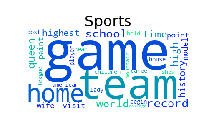

# How to prepare for...

## Background

The current version of the game show, Jeopardy! has been running continuously since 1984. The show has been hosted by Alex Trebek since its inception. Each episode of Jeopardy! has three contestants answering three rounds of questions: Jeopardy, Double Jeopardy, and Final Jeopardy (plus a very rare tie-break round). The first and second rounds contain questions ranging in value from $200 to $2,000. The first two rounds each have six categories with five questions per category. The Final Jeopardy round is a single question where contestants may wager up to the amount they banked in the first two rounds. All answers must be phrased as questions. The winner takes home their cash earnings and has the opportunity to compete in the next game.

Jeopardy! has won a record 33 Daytime Emmy Awards. TV Guide has ranked Jeopardy! as the greatest gameshow of all time. Every month, over 400,000 people visit the official Jeopardy! website [source](https://en.wikipedia.org/wiki/Jeopardy!#Reception). Presumably, many of those visitors are aspiring contestants looking to get a leg up on the competition...

## Project Goal

In the corpus of Jeopardy! questions, there are 27,339 unique categories. Studying over 27,000 topics could be overwhelming to aspiring Jeopardy! contestants. The goal of this project is to group Jeopardy! questions into a manageable number of categories that would-be contestants could use to guide their preparation.

The project will rely on natural language processing and soft clustering methods to group the questions. Well clustered groupings are easily interpreted and distinct from other groups.

## Data

The corpus consists of questions from 3,640 episodes of Jeopardy! The episodes aired between September 10, 1984 (the first episode with Alex Trebek) and January 27, 2012. After removing questions containing media files (pictures, video clips, audio clips) the corpus includes 206,408 documents (questions).

### EDA of Jeopardy DataFrame

The 25 most common answers are as follows (in order of frequency):

'China','Australia','Japan','France','Chicago','India','California','Canada''Spain','Alaska','Mexico','Italy','Hawaii','Texas','Paris','Germany','Russia','Florida','South Africa','Ireland','Brazil','London','Sweden','New Orleans'

Note: They are all geographic locations!

The top 5 Jeopardy! categories (determined by number of questions):

| Category         | Question Count |
|------------------|-------|
| BEFORE & AFTER   | 546   |
| LITERATURE       | 491   |
| SCIENCE          | 480   |
| AMERICAN HISTORY | 413   |
| POTPOURRI        | 383   |

The corpus contains many more questions from the late 90's and first decade of the 2000's than from the early years of the show.

The questions in the corpus are relatively balanced in the months they aired (except for August... it seems no questions air in August). There is a bit of a spike in number of questions airing in August.

### Processing/EDA of Jeopardy Questions Corpus

#### Example Question: "Lava & igneous rock are formed from this hot liquid rock material found under the earth's crust"

| Preprocessing Step                                                                                                                              | Before                                                                                              | After                                                                                                        | Notes                                                                                                                                                                                                                                                              |
|-------------------------------------------------------------------------------------------------------------------------------------------------|-----------------------------------------------------------------------------------------------------|--------------------------------------------------------------------------------------------------------------|--------------------------------------------------------------------------------------------------------------------------------------------------------------------------------------------------------------------------------------------------------------------|
| Remove questions with media files                                                                                                               |  Corpus has ~216,000 questions                                                                      | Corpus drops to ~206,000 questions                                                                           | Lose ~10,000 rows of data                                                                                                                                                                                                                                          |
| Remove punctuation, Lowercase Words, Remove Stopwords, Remove words with less than 4 characters, Lemmatize Words using NLTK's WordNetLemmatizer | "'Lava & igneous rock are formed from this hot liquid rock material found under the earth's crust'" | ['lava', 'igneous', 'rock', 'form', 'liquid', 'rock', 'material', 'earth', 'crust']                          | Lose possessives and conjunctions. Lose some info from some proper nouns? Stopwords...oh stopwords (more on this later). Lose "the","and","are"...great. Lose "sun"...hmm. Take words down to dictionary root (formed--> form...great for reducing dimensionality) |
| Convert questions into a "bag of words"                                                                                                         | ['lava', 'igneous', 'rock', 'form', 'liquid', 'rock', 'material', 'earth', 'crust']                 | [('crust', 1),('earth', 1),('form', 1),('igneous', 1),('lava', 1),('liquid', 1),('material', 1),('rock', 2)] | Get token (in this case, word) frequency. Data is ready for LDA modeling, data can be easily transformed into TF-IDF matrix for NMF and PCA.                                                                                                                                                                                                                          |

#### Answer...

What is...

...for $2,000

After processing the documents, I wanted to see if there were visible, distinct clusters in the data. To do this, I plotted the data on the first two principal components. This plots the data so that the x and y axes are the linear combinations of tokens that explain the most variance.

The colors correspond to the year that the question aired. The seemingly even spread of colors suggests the content of questions is not dependent on year.

#### Stop Words

I started with the list of english stopwords from gensim's parsing.preprocessing package. From there, I built up the list of stop words using LDA models. Tokens that appeared in the top 30 most salient words in multiple topics were added to the list. Some of these included:
>"clue","come","call","say","see","know","name","type","like","mean","term".

After removing stop words, the 20 most frequently seen words in the corpus (nomalized by the probability that they appear in a document) are visualized below:

## Model

The goal of Topic Modeling is to extract topics that are clear (easily understood/explained) and distinct (separate from other topics).

### Choosing Model Type/Package

I tried different types of topic models from different python packages to see which would give me distinct, interpretable topics.

Based on the EDA and my domain knowledge (watching many episodes), my hunch is that are are ~10 basic topics of questions in the Jeopardy! corpus. I would guess there are topics for: geography, history, pop culture, sports, music, theater, literature, movies, politics, international, and then maybe a "mixed-bag" topic.

To determine which model/package to use, I had all three models generate 10 topics. I used 2 iterations for both LDA models.

| Model             | Example Topics                                                                                                                                                               |
|-------------------|------------------------------------------------------------------------------------------------------------------------------------------------------------------------------|
| gensim LDA        | (1) city, river, south, american, country, great, capital, largest, miles  (2) write, title, play, novel, book, character, author, film, king, work                          |
| scikit-learn LDA  | (1) president, french, river, form, world, little, capital, latin, country, rock  (2) city write work island king home line family best create                               |
| scikit-learn NMF  | (1) state, capital, unite, park, secretary, university, border, tree, river, official  (2) country, south, african, american, king, capital, border, island, asian, european |

Just looking at the first 2 topics of each, gensim's LDA model seems to give a clear geography and literature/arts topic. Sklearn's LDA and NMF models have more overlap in the first two topics (either could be geography??).

For these reasons, I chose to move forward with the gensim LDA model. Further, gensim has excellent functionality for topic modeling including very helpful visualizations for tuning.  

### About the Model

Latent Dirichlet Allocation (LDA) is an unsupervised soft clustering technique. When used with a large corpus of text data, LDA can be used to extract hidden topics from large volumes of text.

LDA turns each document into a collection of topics and each topic into a collection of words.

"Topic models learn topics—typically represented as sets of important words—automatically from unlabelled documents in an unsupervised way. This is an attractive method to bring structure to otherwise unstructured text data, but Topics are not guaranteed to be well interpretable, therefore, coherence measures have been proposed to distinguish between good and bad topics."

### Model Optimization

How to improve the gensim LDA model?
* Better text preprocessing (adding to stop words)
* Use the optimal number of topics (human interpretability, coherence, perplexity)  

Optimizing Number of Topics:

| Method 1: Coherence                                                                                                                                                             | Method 2: Perplexity                                                                                                                                                                                                                                                                            |
|---------------------------------------------------------------------------------------------------------------------------------------------------------------------------------|-------------------------------------------------------------------------------------------------------------------------------------------------------------------------------------------------------------------------------------------------------------------------------------------------|
|                                                                                                                                                              |                                                                                                                                                                                                                                                                              |
| Coherence looks at the words in the topics and rates their interpretability. It relies heavily on the distance between topics. The higher the coherence, the better the topics. | "Perplexity is the log likelihood of unseen text documents given the topics defined by a topic model. A good model will have a high likelihood and resultantly low perplexity." [source](https://medium.com/square-corner-blog/topic-modeling-optimizing-for-human-interpretability-48a81f6ce0ed) |

Coherence and perplexity metrics improve as the number of topics increase. The sharpest increase in coherence occurs at 15 topics.
An LDA model with 15 topics produced the following visualization of topics:

Here, there is a lot of overlap in the topics and there are no prominent topics. This suggests there many be too many topics.

The best model both visually and in terms of interpretability used gensim's LDA with 8 topics.

The interpreted latent topics from this model are below (visualized as a word cloud from their 30 most common words).

|   |                   |
|----------------------------|-----------------------------------------|
|     |         |
|  |                  |
|       |  |

The following table provides two example questions that I believed should be "science" questions. The table shows how the questions loaded onto each of the topics. They both loaded heavily onto "science." However,the first one loaded most heavily onto sports. So, using a simple softmax function, the first question would be classified (incorrectly, I believe) as a "sports" question.

| Question                                                                                        | Sports | History | Science/Measurement | Music | Geography | Literature | Cuisine | Film and Theatre |
|-------------------------------------------------------------------------------------------------|--------|---------|---------------------|-------|-----------|------------|---------|------------------|
| Lava & igneous rock are formed from this hot liquid rock material found under the earth's crust | .42    | .01     | .36                 | .01   | .01       | .01        | .14     | .01              |
| One mole of any substance always has the same number, 6.022 x 1023 of these          | .03    | .28     | .53                 | .03   | .03       | .03        | .03     | .03              |

# Conclusion

Topic modeling seems to be all about preprocessing the text data. I could have spent many more days experimenting with different ways to featurize the corpus.

Additionally, a lot of topic modeling is up to interpretation (how to label latent topics, how to judge the quality of topics, etc.)

I got reasonable topics from gensim's LDA model. The EDA suggested that many of the questions center around geography. The model produced a latent topic with words that seem consistent with geographic themes! yay! I also found strong latent topics related to sports, cuisine, literature, music, science, and film/theatre. The topic interpreted as "history" may be a bit of a stretch. It did include words like "french","ancient","time","event", and "cause" that seem reasonable.

A quick review of how questions loaded onto topics suggested that the model performed reasonably well (how is that for a data science metric??).

SO... to answer the initial question, "How can you prepare to be on Jeopardy! ?"

I would conclude that you should focus studies on:

* Geography
* Sports
* History
* Science/Measurement
* Cuisine
* Literature
* History
* Music

# Future Direction
* Use spaCy's lemmatizer to preprocess words
* Experiment with n_grams
* Continue to tune stop words
* Run on AWS to experiment with more models (more iterations, more topics)
*  Deepen understanding of coherence and perplexity.
