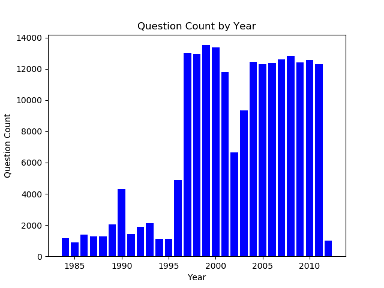
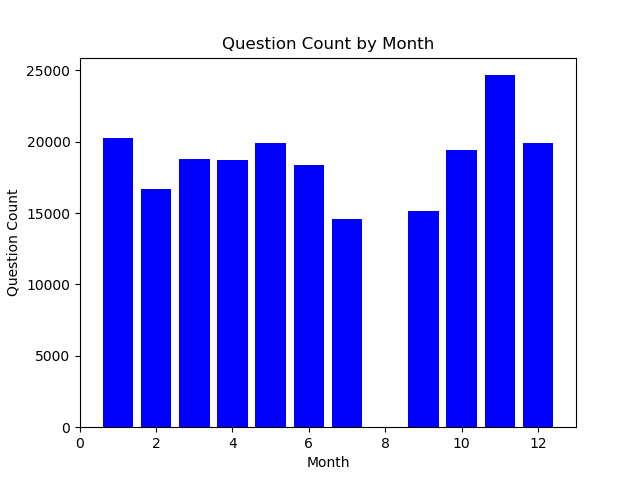

# How to prepare for...

## Background

The current version of the game show, Jeopardy! has been running continuously since 1984. The show has been hosted by Alex Trebek since its inception. Each episode of Jeopardy! has three contestants answering three rounds of questions: Jeopardy, Double Jeopardy, and Final Jeopardy (plus a very rare tie-break round). The first and second rounds contain questions ranging in value from $200 to $2,000. The first two rounds each have six categories with five questions per category. The Final Jeopardy round is a single question where contestants may wager up to the amount they banked in the first two rounds. All answers must be phrased as questions. The winner takes home their cash earnings and has the opportunity to compete in the next game.

Jeopardy! has won a record 33 Daytime Emmy Awards. TV Guide has ranked Jeopardy! as the greatest gameshow of all time. Every month, over 400,000 people visit the official Jeopardy! website. Presumably, many of those visitors are aspiring contestants looking to get a leg up on the competition...

## Project Goal

In the corpus of Jeopardy! questions, there are 27,339 unique categories. Studying over 27,000 topics could be overwhelming to aspiring Jeopardy! contestants. The goal of this project is to group Jeopardy! questions into a manageable number of categories that would-be contestants could use to guide their preparation.

The project will rely on natural language processing and soft clustering methods to group the questions. Well clustered groupings are easily interpreted and distinct from other groups.

## Data

The corpus consists of questions from 3,640 episodes of Jeopardy! The episodes aired between September 10, 1984 (the first episode with Alex Trebek) and January 27, 2012. After removing questions containing media files (pictures, video clips, audio clips) the corpus includes 206,408 documents (questions).

### EDA of Jeopardy DataFrame

The 25 most common answers are as follows (in order of frequency):

'China','Australia','Japan','France','Chicago','India','California','Canada''Spain','Alaska','Mexico','Italy','Hawaii','Texas','Paris','Germany','Russia','Florida','South Africa','Ireland','Brazil','London','Sweden','New Orleans'

Note: They are all geographic locations!

The top 5 Jeopardy! categories (determined by number of questions):

| Category         | Question Count |
|------------------|-------|
| BEFORE & AFTER   | 546   |
| LITERATURE       | 491   |
| SCIENCE          | 480   |
| AMERICAN HISTORY | 413   |
| POTPOURRI        | 383   |

The corpus contains many more questions from the late 90's and first decade of the 2000's than from the early years of the show.

The questions in the corpus are relatively balanced in the months they aired (except for August... it seems no questions air in August).

### Processing/EDA of Jeopardy Questions Corpus

#### Example Question: "Lava & igneous rock are formed from this hot liquid rock material found under the earth's crust"

| Preprocessing Step                                                                                                                              | Before                                                                                              | After                                                                                                        | Notes                                                                                                                                                                                                                                                              |
|-------------------------------------------------------------------------------------------------------------------------------------------------|-----------------------------------------------------------------------------------------------------|--------------------------------------------------------------------------------------------------------------|--------------------------------------------------------------------------------------------------------------------------------------------------------------------------------------------------------------------------------------------------------------------|
| Remove questions with media files                                                                                                               |  Corpus has ~216,000 questions                                                                      | Corpus drops to ~206,000 questions                                                                           | Lose ~10,000 rows of data                                                                                                                                                                                                                                          |
| Remove punctuation, Lowercase Words, Remove Stopwords, Remove words with less than 4 characters, Lemmatize Words using NLTK's WordNetLemmatizer | "'Lava & igneous rock are formed from this hot liquid rock material found under the earth's crust'" | ['lava', 'igneous', 'rock', 'form', 'liquid', 'rock', 'material', 'earth', 'crust']                          | Lose possessives and conjunctions. Lose some info from some proper nouns? Stopwords...oh stopwords (more on this later). Lose "the","and","are"...great. Lose "sun"...hmm. Take words down to dictionary root (formed--> form...great for reducing dimensionality) |
| Convert questions into a "bag of words"                                                                                                         | ['lava', 'igneous', 'rock', 'form', 'liquid', 'rock', 'material', 'earth', 'crust']                 | [('crust', 1),('earth', 1),('form', 1),('igneous', 1),('lava', 1),('liquid', 1),('material', 1),('rock', 2)] | Get token (in this case, word) frequency.                                                                                                                                                                                                                          |

#### Answer...

What is...

...for $2,000

## Model

Latent Dirichlet Allocation (LDA) is an unsupervised soft clustering technique. When used with a large corpus of text data, LDA can be used to extract hidden topics from large volumes of text.

Goal:

Extract topics that are clear (easily understood/explained) and distinct (separate from other topics).

How to get there?
* Good text preprocessing
* Optimal number of topics

In the case of this project, LDA will take the bag of words produced by the corpus of questions ...

LDA turns each document into a collection of topics and each topic into a collection of words.
